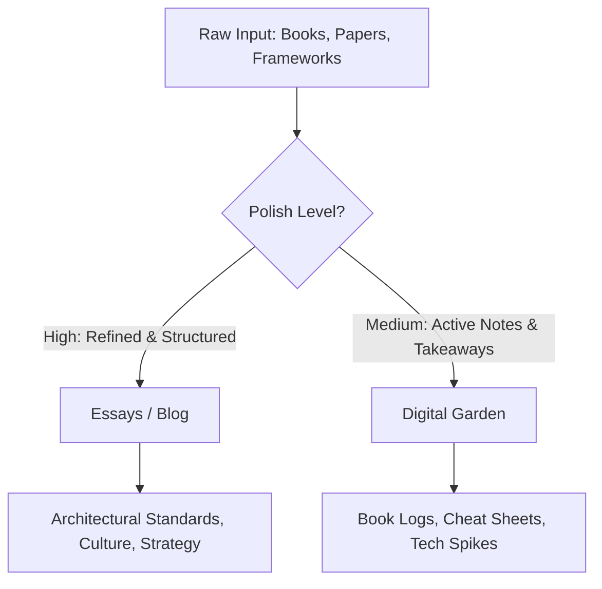

In senior technology roles, we are often flooded with information. We read research papers, books, and architectural reviews, constantly parsing the noise to extract high-value signals. 

When establishing a public brand or professional presence, the instinct is often to build a standard blog. However, for a Distinguished Engineer or senior architect, a traditional chronological blog is insufficient. It forces a false binary: either you publish a highly-polished, peer-reviewed-level essay, or you publish nothing at all.

To solve this, I structure my digital footprint into two distinct components: **Essays** and a **Digital Garden**.

---

## The Two-Tier System: Polish vs. Growth

### 1. Essays (The "High-Signal" Blog)
This is the repository for finished thinking. 
* **The Bar**: High. Every piece must offer deep architectural insight, organizational strategy, or a definitive decision framework.
* **Frequency**: Low. One essay every month or quarter is plenty. 
* **Intent**: To serve as a durable, long-term reference for other technology leaders.

### 2. The Digital Garden (The "Active" Sandbox)
This is a repository of raw, organic learning. 
* **The Bar**: Low to Medium. It is structured as reading logs, quick code spikes, cheat sheets, and active synthesis of books or research papers.
* **Frequency**: High. Updated whenever a notable insight is extracted from a book or when experimenting with a new framework.
* **Intent**: "Learning in public." It is search-optimized, structured by topic rather than date, and serves as an intellectual logbook.

---

## Why This Division Matters for Senior Leaders

1. **Eliminating the Blank Page Syndrome**: By lowering the barrier to entry for the Digital Garden, you can publish valuable book summaries (like key database take-aways) without the pressure of writing a perfect 3,000-word editorial.
2. **Preserving Brand Signal**: When recruiters, peers, or junior engineers visit your site, they see your polished architectural philosophies first (Essays). If they want to assess your technical depth or curiosity, they can dive into your active notes (Garden).
3. **Thought Curation over Content Creation**: You do not need to generate noisy daily updates. Your reading habit *is* the content. By synthesizing what you read, you filter the noise for others, immediately positioning yourself as a trusted technologist.

A professional digital presence shouldn't feel like a chore. By separating the garden from the greenhouse, you build a sustainable rhythm for sharing knowledge.
